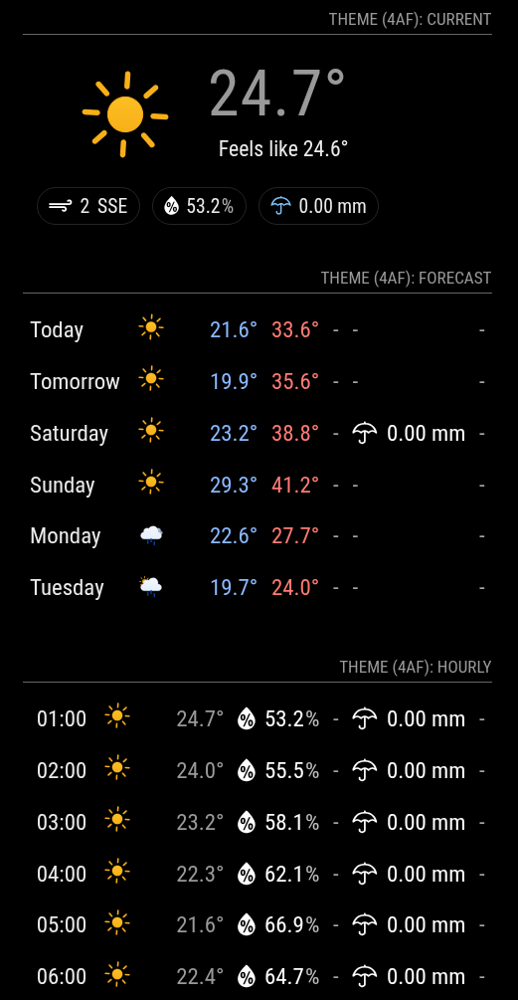

# MMT-WeatherOneTheme

Weather theme for the MagicMirror² weather module.

This theme is a visual layer for the default MagicMirror² `weather` module.
It keeps all core provider and feature support, adds a compact badge-based style, and enables multiple icon sets. Some icon sets are animated, and some are static. See the [Icon Gallery](https://kristjanesperanto.github.io/MMT-WeatherOneTheme/) for details.

## Screenshot



## Install

Clone this repository into your modules directory:

```sh
cd ~/MagicMirror/modules
git clone https://github.com/KristjanESPERANTO/MMT-WeatherOneTheme
```

## Usage

Use the normal `weather` module and point `themeDir` to this theme directory.

```js
    {
      module: "weather",
      position: "top_right",
      config: {
        type: "current", // or "forecast" / "hourly"
        weatherProvider: "openmeteo", // any provider supported by core weather
        lat: 59.322665,
        lon: 18.069666,
        themeDir: "../../../modules/MMT-WeatherOneTheme",
        iconset: "4af", // Meteocons fill animated

        // optional weather module options
        showFeelsLike: true,
        showPrecipitationAmount: true,
        showPrecipitationProbability: true,
        showUVIndex: true,
        colored: true,
        fade: true
      }
    },
```

You can instantiate `weather` multiple times and use this same theme for `current`, `forecast`, and `hourly` views.

## Demo

Run the theme demo from the theme directory:

```sh
cd ~/MagicMirror/modules/MMT-WeatherOneTheme
node --run demo
```

The demo uses `yr` and three weather module instances (`current`, `forecast`, `hourly`) with `themeDir` set to this theme.

## Icon Sets

This theme includes multiple weather icon sets. Set `iconset` in your weather config and pick the set you want.

**View previews and icon set details:** [Icon Gallery](https://kristjanesperanto.github.io/MMT-WeatherOneTheme/)

## License

This theme is MIT licensed. See [LICENSE](LICENSE). For icon set licensing details, see the [Icon Gallery](https://kristjanesperanto.github.io/MMT-WeatherOneTheme/).
